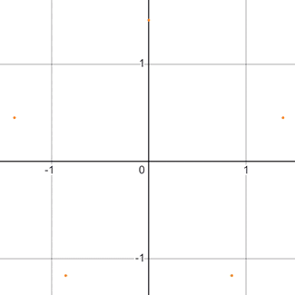
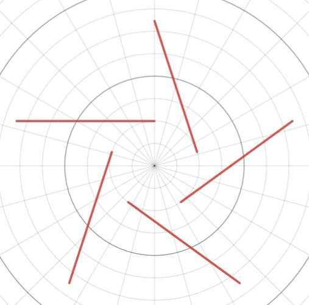
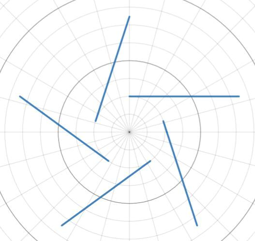
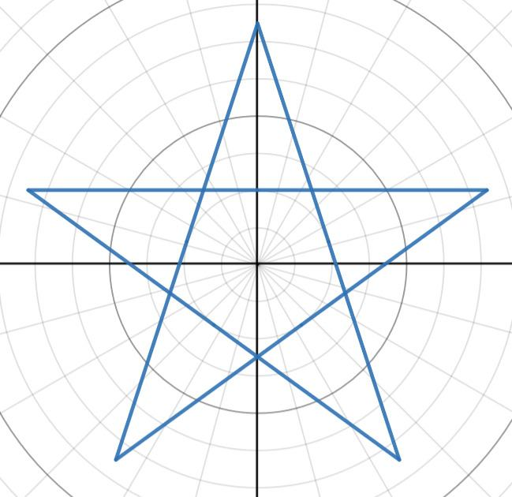
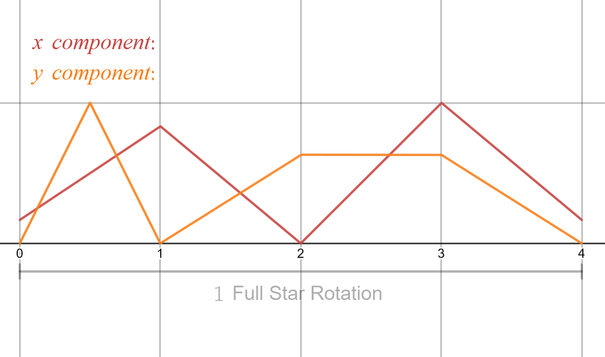
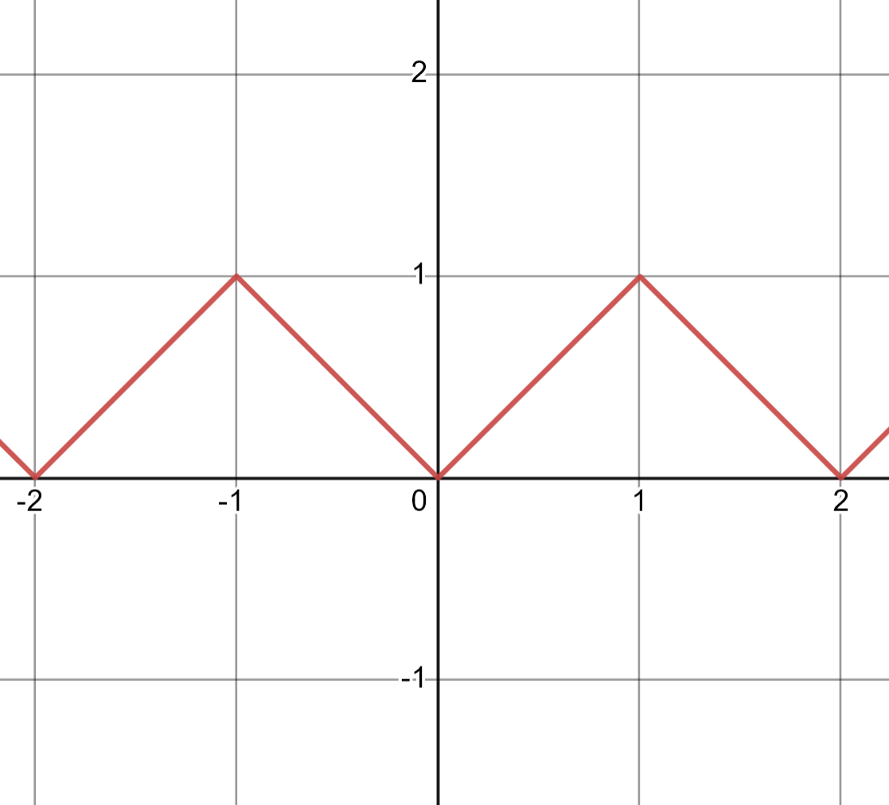
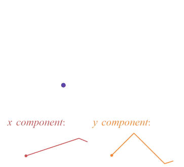
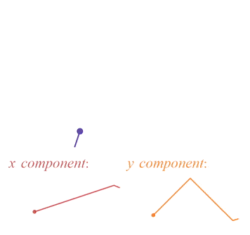

<a style="font-size: calc(1rem + 4px); visibility: hidden; margin-left: -25px;">✧</a>

<a class="link" style="" href="../index.html">Index</a>

<a class="link" style="" href="../blogs.html">Blog</a>

<a class="link" style="" href="../software.html">Software</a>

<a class="link" style="" href="../games.html">Games</a>

<a style="">Photography</a>

<a class="link" style="" href="../cv.html">CV</a>

<!-- pandoc -s --mathjax -c blog_style.css blog_2.md -o blog_2.html -->

# Post \#2: Functions for Stars and Polygons

Published: October 28, 2023

Another blog I'm writing on my new personal website... yay !! This blog is entitled 'Functions for Stars and Polygons.' I started this a while back with the vague goal of graphing a five-pointed star with a function. Any function really, but it had to draw out a star. There are many methods of going about this type of thing, using polar functions, parametric functions, or other techniques that aren't even functions (which I end up using as well.) This blog post serves as an outline of my journey. It's also a way to highlight some logic and math I found interesting and want to share, so hopefully you may learn something or get inspired or at the very least enjoy reading this post.

<!-- <iframe src="https://www.desmos.com/calculator/h4p3qvpni2?embed" class="frame" width="200" height="200" frameborder=0></iframe> -->

\

<!-- ``{=html} -->

I'm going to start with a way to graph a star with a polar function. A polar function is a function defined in polar cordinates, described by a radius $r$ and an angle theta $\theta$. This cordinate system is actually super convenient for drawing something like a star, because you can kind of think of a star as being nice and symetrical around $\theta$.

\

The shape we want to graph with a polar expression is made up exclusively of straight and diagonal lines. In a star, each line is angled in such a way that they connect and form five sided. So how can this series of lines be graphed with a polar function?

We can start with an expression for a vertical line in polar form:
 
$$r=\frac{1}{\frac{1}{A}\cos(\theta)}$$

Where $A$ is the intersection with the x-axis.

<!-- <iframe src="https://www.desmos.com/calculator/dgjiddulgw?embed" width="400" height="400" frameborder=0></iframe> -->
And an expression for a diagonal line in polar form:

$$r=\frac{1}{\frac{1}{A}\cos(\theta)+\frac{1}{{\color{orange}B}}\sin(\theta)}$$

Where $A$ is the intersection with the x-axis and $B$ is the intersection with the y-axis.

<!--
<iframe src="https://www.desmos.com/calculator/bxrvicej6i?embed" width="400" height="400" frameborder=0></iframe>
<iframe src="https://www.desmos.com/calculator/xho8ivzvab?embed" width="400" height="400" frameborder=0></iframe>
<iframe src="https://www.desmos.com/calculator/c5mlquk5ac?embed" width="400" height="400" frameborder=0></iframe>
<iframe src="https://www.desmos.com/calculator/mrnjhznhp9?embed" width="400" height="400" frameborder=0></iframe>
<iframe src="https://www.desmos.com/calculator/uyk2bnyb6g?embed" width="400" height="400" frameborder=0></iframe>
<iframe src="https://www.desmos.com/calculator/dn0hmewtym?embed" width="400" height="400" frameborder=0></iframe>
<iframe src="https://www.desmos.com/calculator/xsc0jdp7dh?embed" width="400" height="400" frameborder=0></iframe>
<iframe src="https://www.desmos.com/calculator/hrdpgdmqjw?embed" width="400" height="400" frameborder=0></iframe>
<iframe src="https://www.desmos.com/calculator/ayxof2p7fe?embed" width="400" height="400" frameborder=0></iframe>
<iframe src="https://www.desmos.com/calculator/gto0krrwp7?embed" width="400" height="400" frameborder=0></iframe>
<iframe src="https://www.desmos.com/calculator/otidbhqz8i?embed" width="425" height="425" frameborder=0></iframe>
<iframe src="https://www.desmos.com/calculator/l21q8rrpkp?embed" width="380" height="380" frameborder=0></iframe>
<iframe src="https://www.desmos.com/calculator/s1vykdj4hs?embed" width="400" height="400" frameborder=0></iframe>
<iframe src="https://www.desmos.com/calculator/rdzon9wio5?embed" width="400" height="400" frameborder=0></iframe>
<iframe src="https://www.desmos.com/calculator/y8afb1bpad?embed" width="250" height="250" frameborder=0></iframe>
<iframe src="https://www.desmos.com/calculator/ufdich7tu8?embed" width="250" height="250" style="border: 1px solid #ccc" frameborder=0></iframe>
<iframe src="https://www.desmos.com/calculator/tzmmseu62z?embed" width="250" height="250" style="border: 1px solid #ccc" frameborder=0></iframe>
<iframe src="https://www.desmos.com/calculator/t7vomgmv6l?embed" width="400" height="400" frameborder=0></iframe>
<iframe src="https://www.desmos.com/calculator/tfocx1rrbm?embed" width="400" height="300" frameborder=0></iframe>
<iframe src="https://www.desmos.com/calculator/vkseewbs2a?embed" width="500" height="500" style="border: 1px solid #ccc" frameborder=0></iframe
<iframe src="https://www.desmos.com/calculator/9azilw0lg3?embed" width="450" height="400" style="border: 1px solid #ccc" frameborder=0></iframe>
<iframe src="https://www.desmos.com/calculator/wmu6rp7thq?embed" width="450" height="400" style="border: 1px solid #ccc" frameborder=0></iframe>
<iframe src="https://www.desmos.com/calculator/vj60isweoo?embed" width="500" height="500" style="border: 1px solid #ccc" frameborder=0></iframe>
<iframe src="https://www.desmos.com/calculator/c3gbmhvk1t?embed" width="500" height="500" style="border: 1px solid #ccc" frameborder=0></iframe>
<iframe src="https://www.desmos.com/calculator/2mza7wlzxb?embed" width="450" height="400" style="border: 1px solid #ccc" frameborder=0></iframe>
<iframe src="https://www.desmos.com/calculator/lj2xkiviyp?embed" width="450" height="400" style="border: 1px solid #ccc" frameborder=0></iframe>
<iframe src="https://www.desmos.com/calculator/zdpunfaiok?embed" width="450" height="400" style="border: 1px solid #ccc" frameborder=0></iframe>
<iframe src="https://www.desmos.com/calculator/wxvpoyxdiy?embed" width="450" height="400" style="border: 1px solid #ccc" frameborder=0></iframe>
<iframe src="https://www.desmos.com/calculator/uswjrbzltq?embed" width="500" height="500" style="border: 1px solid #ccc" frameborder=0></iframe>
<iframe src="https://www.desmos.com/calculator/dnvrsvkvqj?embed" width="500" height="500" style="border: 1px solid #ccc" frameborder=0></iframe>
<iframe src="https://www.desmos.com/calculator/sbqhbwzkfb?embed" width="500" height="500" style="border: 1px solid #ccc" frameborder=0></iframe>
<iframe src="https://www.desmos.com/calculator/2ig0ea8ycm?embed" width="500" height="500" style="border: 1px solid #ccc" frameborder=0></iframe>
<iframe src="https://www.desmos.com/calculator/3bgirqephm?embed" width="450" height="400" style="border: 1px solid #ccc" frameborder=0></iframe>
<iframe src="https://www.desmos.com/calculator/m0ksatpfwd?embed" width="450" height="400" style="border: 1px solid #ccc" frameborder=0></iframe>
<iframe src="https://www.desmos.com/calculator/frhhwszn10?embed" width="400" height="400" style="border: 1px solid #ccc" frameborder=0></iframe>
<iframe src="https://www.desmos.com/calculator/y3jhs0gmw0?embed" width="400" height="400" style="border: 1px solid #ccc" frameborder=0></iframe>
<iframe src="https://www.desmos.com/calculator/axtjphr4wo?embed" width="400" height="400" style="border: 1px solid #ccc" frameborder=0></iframe>
<iframe src="https://www.desmos.com/calculator/9krmg5bgwi?embed" width="400" height="400" style="border: 1px solid #ccc" frameborder=0></iframe>
<iframe src="https://www.desmos.com/calculator/fqpmmabsac?embed" width="400" height="400" style="border: 1px solid #ccc" frameborder=0></iframe>
<iframe src="https://www.desmos.com/calculator/zk1gkxqau0?embed" width="400" height="400" style="border: 1px solid #ccc" frameborder=0></iframe>
<iframe src="https://www.desmos.com/calculator/jyu5vptm2b?embed" width="400" height="400" style="border: 1px solid #ccc" frameborder=0></iframe>
<iframe src="https://www.desmos.com/calculator/chcdexaszm?embed" width="400" height="400" frameborder=0></iframe>
-->
<iframe src="https://www.desmos.com/calculator/wuuukjxqdc?embed" width="400" height="400" frameborder=0></iframe>

So why does this expression take this form? There's a $\cos(\theta)$ and a $\sin(\theta)$ and they're in the denominator. Seems like this somehow relates to $\sec(\theta)$ and $\csc(\theta)$. This relationship does make sense, since $r=\sec(\theta)$ results in a vertical line and $r=\csc(\theta)$ results in a horizontal line. Naturally combining the two would make a diagonal line.

>On a side note, something kind of interesting with the diagonal line expression is its behaviour when $A$ or $B$ change. For example, as say $B$ increases, the $\sin(\theta)$ term loses magnitude. As $B$ approaches $\infty$, the $\frac{1}{B}\sin(\theta)$ term approaches $\frac{1}{\infty}\sin(\theta)$ or $0\sin(\theta)$. This results in the expression turning into the expression for a vertical line: $\frac{1}{\frac{1}{A}\cos(\theta)}$. This is also reflected in the graph. As $B$ approaches $\infty$ the slope increases making the graph approach a vertical line. Also notice how it's impossible to graph either a horizontal or vertical line with the diagonal line expression if you try to do the opposite and make A or B 0 instead of $\infty$. A and B being in the denominator means if they are in fact 0, then the graph is undefined.

>On another side note, the reciprocal of this diagonal line function, $r=A\cos(\theta)+B\sin(\theta)$, results in a similar looking graph, but also something slightly different:

<!-- <iframe src="https://www.desmos.com/calculator/r1xqwjf82z?embed" width="400" height="400" frameborder=0></iframe> -->
<iframe src="https://www.desmos.com/calculator/wh0nlvutcf?embed" width="400" height="400" frameborder=0></iframe>

>For $r=A\cos(\theta)+B\sin(\theta)$ when $\theta=0$, the radius only depends on the value of $\cos(\theta)$. When $\theta=\frac{\pi}{2}$ the radius only depends on the value of $\sin(\theta)$. Putting coeffeicents before the terms allows us to control the x-axis and y-axis intersections of the circle. In the above graph, the coefficent of cos is held constant at 1, so there's an intersection at (1, 0). The coefficent of sin can change so there's an intersection at (0, value of the coefficent of sin). This expression is similar to the expression of the diagonal line, the coeffeicents of cos and sin can be changed to control the x-axis and y-axis intersections respectively. The difference is this expression yeilds a circle while the previous yeilds a straight line.

<iframe src="https://www.desmos.com/calculator/3mlnyu0myq?embed" width="400" height="400" frameborder=0></iframe>

<!-- \ -->

Before we move to graphing multiple lines at once with an expression, we should touch on how these lines will be angled. For a five-pointed star we will need five lines. And the sum of the interior angles will be $360\textdegree$, or $2\pi$. If you follow the lines you will see the path of a five-pointed star does two full roations around its origin. A triangle does one roation and its interior angles sum to $180\textdegree$, so our five-pointed star's interior angles will sum to $360\textdegree$. Also notive for a five-pointed star, all interior angles are equal. In other words, we could say something like each side of the star should be angled $72\textdegree$ or $\frac{2\pi}{5}$ radians more than the previous. (We could also generalize this statement a bit and say for any n sided star, it's interior angles are equal to $\frac{2\pi}{n}$.)

How can these five lines of a five-pointed star be graphed with one expression? And how can we control the interior angles so that they make up the correctly numbered sided star? First we can employ the help of the modulo operator.

For example, $y=mod(x, 1)$:

")\

The modulo operator divides the input by a certain number and ouputs the remainder of that division. Notice the usual $y=x$ graph repeats every 1. If the expression is $y=mod(x, 2)$ the graph would repeat every 2. We can use this in polar coordinates to achieve the same graph repeating effect.

For example, $r=mod(\theta,\frac{\pi}{2})$:

")\

We can also use the modulo operator for our diagonal line expression:

<!--
<iframe src="https://www.desmos.com/calculator/vp4kiu2jqb?embed" width="500" height="500" style="border: 1px solid #ccc" frameborder=0></iframe>
<iframe src="https://www.desmos.com/calculator/dqcxqmnqwe?embed" width="500" height="500" style="border: 1px solid #ccc" frameborder=0></iframe>
<iframe src="https://www.desmos.com/calculator/x7z3fx7cel?embed" width="500" height="500" style="border: 1px solid #ccc" frameborder=0></iframe>
<iframe src="https://www.desmos.com/calculator/wyiwome8do?embed" width="500" height="500" style="border: 1px solid #ccc" frameborder=0></iframe>
<iframe src="https://www.desmos.com/calculator/zu6bezqxkq?embed" width="500" height="500" style="border: 1px solid #ccc" frameborder=0></iframe>
<iframe src="https://www.desmos.com/calculator/svo8obioul?embed" width="500" height="500" style="border: 1px solid #ccc" frameborder=0></iframe>
<iframe src="https://www.desmos.com/calculator/d465l4m6mz?embed" width="450" height="450" frameborder=0></iframe>
-->
<iframe src="https://www.desmos.com/calculator/qkvymv5g6m?embed" width="450" height="450" frameborder=0></iframe>
<!-- <iframe src="https://www.desmos.com/calculator/kq9yd7w2sb?embed" width="500" height="500" frameborder=0></iframe> -->

Where $Z$ is the interval $\theta$ the function repeats on.
<!--
Plugging in $\frac{2\pi}{5}$ to the modulo operator yeilds:
This shape is very close to a star. It has 5 sides which are straight lines and they're at the correct angles. It's just they're too, slanted maybe? What if we alter the modulus value for only the $\sin(\theta)$ term?
So close! But also not quite there yet. Let's look back at our goal, a five-pointed star. Notice its lines are straight, really straight. They're almost more like long straight vertical lines than diagonal lines. Actually, what if we were to remove the sin term completely? We'd be left with a expression for a vertical line again, but this time with a modulo.
$r=\frac{1}{\cos(\theta\mod\frac{2\pi}{5})}
Wow! half a star! So we can see this clearly now. The star really is a series of vertical line expressions. And since there's a modulo, the function keeps repeating after certain $\theta$ values have been reached, resulting in the vertical lines being angled every $\frac{2\pi}{5}$, resulting in half a five-sided star!
-->

After trial and error, I eventually found an expression that almost yields the star I'm looking for:

$$r=\frac{1}{\cos\left(\operatorname{mod}\left(\theta-\frac{\pi}{10},\frac{2\pi}{5}\right)\right)}$$ 

\

A couple things to note: the $-\frac{\pi}{10}$ term is added to $\theta$ in order to rotate the star so it's facing upwards correctly, and also it seems like half the star is missing. The graph can be flipped by multiplying the $\frac{2\pi}{5}$ term by -1:

\

Great so we now have two graphs in polar coordinates that describe a five pointed star. But in order to draw a star with just one function, we need a way to draw out both halves of the star. Maybe we could draw out the first half of the star, then draw out the other half, combining these two functions in some way. The only difference between the two functions is the $\frac{2\pi}{5}$ term. One half of the star is drawn with the term $\frac{2\pi}{5}$ being positive and the other half being negative. We could add a new term to toggle the $\frac{2\pi}{5}$ term from positive to negative. On the interval of $\theta$ from 0 to $2\pi$ the $\frac{2\pi}{5}$ term will be positive and on the interval $2\pi$ to $4\pi$ it will be negative. This way we could draw out both functions with a single expression, switching the sign of the $\frac{2\pi}{5}$ term halfway through.

To define the term we will need that switches from positive to negative, or 1 to -1, we can use the floor function. The floor function rounds an input down to the nearest integer, for example $y=floor(x)$:

")\

And $y=floor(\frac{x}{\pi})$:

")\

The floor function always rounds the input down to the nearest integer, however notice we can transform the input and as a result round the output down by different step lengths. Dividing x by $\pi$ results in x being rounded down every $\pi$ instead of every 1.

We can alter this function in such a way that it will basically return a 0 when the input is between 0 and $2\pi$ and a 1 when the input is between $2\pi$ and $4\pi$. Since the floor function can be described as: $y=floor(\frac{x}{n})$, where n is the interval between each rounded output, the expression $y=floor(\frac{x}{2\pi})$ will output what we want: 0 from 0 to $2\pi$ and then increase to 1 from $2\pi$ to $4\pi$. In our case, we don't care what the value of the function is outside of these intervals.

Now to define the term that will switch the sign of our $\frac{2\pi}{5}$ term, from positive on the interval 0 to $2\pi$ and negative on the interval $2\pi$ to $4\pi$, we will raise -1 to the power of the output of our floor function. So our new term will be defined as: $-1^{floor(\frac{\theta}{2\pi})}$. Notice ${-1^{0}=1}$ and ${-1^{1}=-1}$.

Now that we have a term that can switch signs, in other words switch value from 1 to -1, we can implement it into our original polar star expression, yielding a new expression defined as:

$$r=\frac{1}{\cos\left(\operatorname{mod}\left(\theta-\frac{\pi}{10},\left(-1\right)^{\operatorname{floor}\left(\frac{\theta}{2\pi}\right)}\cdot\frac{2\pi}{5}\right)\right)}$$

\

Yay!! So that's the expression I came up with in the end to draw a five pointed star with a polar equation. I'm sure it's not the only polar equation that draws out a star like this, also functions like this can always be slightly tweaked and modified to draw out a pretty much endless amount of shapes and patterns (like in the above interactive graph with the modulo operator for the diagonal line expression, there's a huge amount of things you can do with just one simple expression!) So with this success, I'd now like to move on to graphing a five-pointed star, but in the cartesian plane, that is with an expression in terms of x and y.

\

My strategy for graphing a five-pointed star with x and y is to use a parametric equation. Something like $f(x(t), y(t))$ to describe a position over time. I could assign a point to move according to this equation and trace out its path. Given the correct equation, this would yeild a five-pointed star shape. To draw out the star, the dot has to kind of go back and forth in both its x and y axes. Considering this I defined functions for both x and y. They look like this:

\

Both functions are basically zigzags going up and down at certain intervals over time. Also there's a section in the y function that is flat, maybe you can guess why. Anyway to construct these two functions I used peicewise functions of modulus expressions. The same used in the previous polar expressions. I also multiplied x by the sign switching term also in the previous polar expressions. This yeilds a function:

$$y=\operatorname{mod}\left(x\cdot\left(-1\right)^{\operatorname{floor}\left(x\right)},1\right)$$

\

The mod term is the same used in the previous polar expressions, used to repeat a function over a specified interval. In this case I use it to repeat x over the interval 1. In addition there's yet another term used in the previous polar expressions, $(-1)^{floor(x)}$. This term switches from 1 to -1 to 1 and so on, on the interval of 1. This basically switches the slope of the line every 1 giving it the zigzag-like appearance.

Using these functions, altering the amplitudes and frequencies, and some trial and error I described the above peicewise functions of x and y. A point can be assigned to move according to these functions, in other words have its position determined by the x peicewise function and y peicewise function with respect to time. The point's position could be expressed in the form: $f(x(t), y(t))$. So the movement of the point overtime would looke like:

\

Adding a trail to show its path:

\

And you can probably see the reason why part of the y peicewise function was flat, it's because during that time, the dot is drawing the side of the star that's horizontal to the x axis, meaning the y value doesn't change. So that's the method I used to graph a five-pointed star with a parametric equation. Not really one single equation, instead I peiced together multiple zigzag functions into expressions for both an x position and y position with respect to time. Drawing out the path the position moves on overtime, reveals the star. Next I'd like to describe another method of drawing a five-pointed star, this more focused on interior and exterior angles. This method involves creating a list of points, then connecting them with line segments, forming a star.

\

Let's describe the shape of a star in a different way than what we've done up until now. Say instead of represtenting the star, or any shape, with a function, we instead represent it with vectors. For each side of a shape, there exists a vector pointing in that same direction. So a way of describing a shape would be by a list of vectors. Each vector would begin where the previous ends, and each would have a very specific angle.

For example, a square could be represented by four vectors and each vector's angle would be $90\textdegree$ greater than the previous. Adding all the angles of the four vectors together that describe the sides of the square yeilds $360\textdegree$ ($4\times90\textdegree$.) or a full rotation. This makes sense because the vectors should create a full shape, in other words the sides of the shape start where they end, making one full rotation. If the angles of the four vectors were smaller or larger, they wouldn't be able to connect to make a square. Another example, the sides of an isosceles triangle. A vector's angle in this case would be $120\textdegree$ greater than the previous vector. Again the angles of the three vectors that make up the sides of the traingle sum to $360\textdegree$. We can alter the difference in angles between the vectors, in other words the exterior angles, to create a huge amount of different shapes.

<iframe src="https://www.desmos.com/calculator/9noexzltrw?embed" width="450" height="450" frameborder=0></iframe>

Notice how any sided polygons can be made with the vectors if there are enough. Also at a certain point (depending on the number of vectors) the sides of the shape will rotated around a second time. This is what creates the five sided star shape. Specifically when the exterior angles are $\frac{4\pi}{5}$ and $\frac{6\pi}{5}$ radians or $144\textdegree$ and $216\textdegree$. Depending on the number of vectors, or sides you have, any star or polygon can be made by changing its exterior angles!

So those are just a few methods I've discovered that can be used to construct a star mathematically. Some ways are speifically defined composite functions and another slightly different way to describe shapes and polygons with vectors and exterior angles. Anyway that’s a quick summary of what I've learned, as always if you have questions or feedback please contact at: [maxcontact5@keemail.me](mailto:maxcontact5@keemail.me). Thanks for reading!